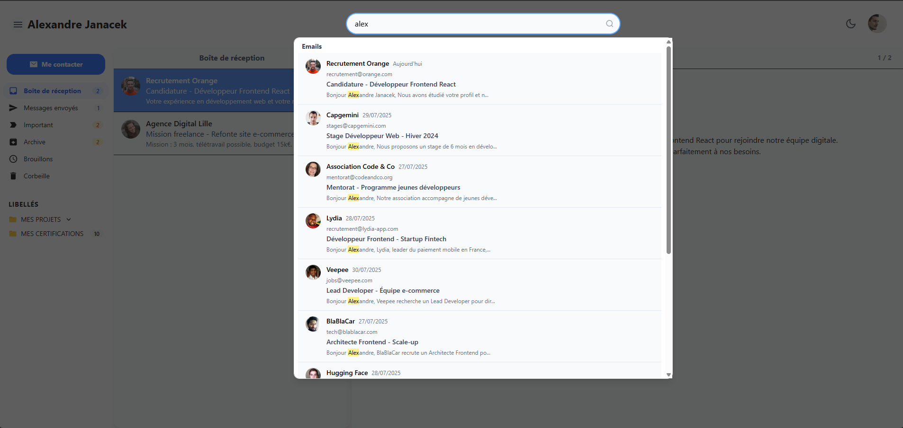
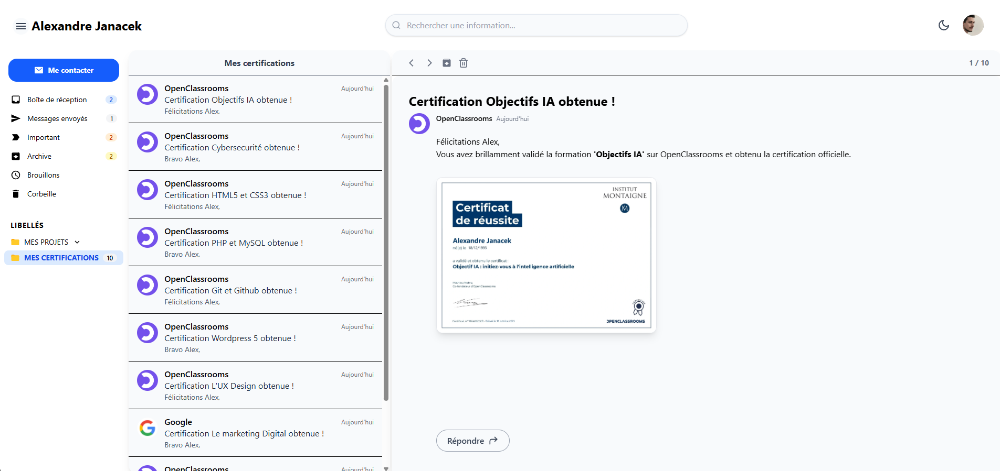
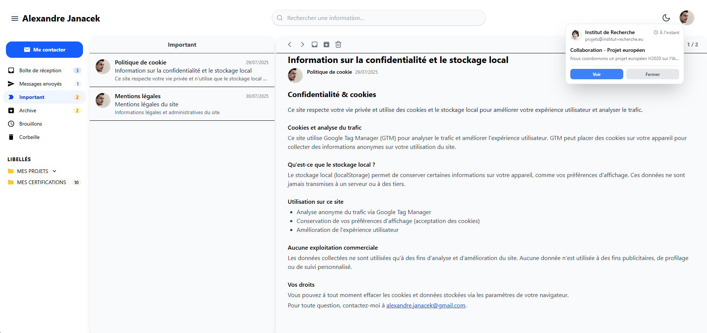
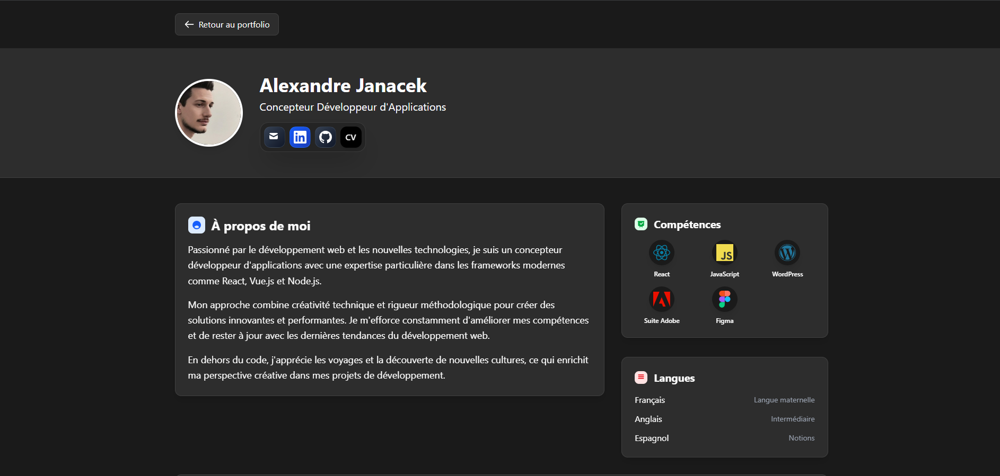
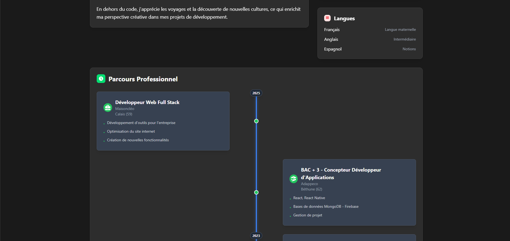

# Portfolio Boite Mail

Portfolio moderne et interactif présentant mes compétences de développeur web avec une interface inspirée d'un client email professionnel.

## 🎯 Fonctionnalités principales

### 📧 Interface Email Interactive
- **Boîte de réception virtuelle** avec emails de recrutement, projets et certifications
- **Popups de notifications** en temps réel avec mise à jour automatique du temps
- **Système de catégories** : Boîte de réception, Important, Archive, Corbeille, Messages envoyés
- **Recherche avancée** avec filtrage en temps réel
- **Mode sombre/clair** avec persistance des préférences

### 🎮 Expérience Utilisateur
- **Animation d'introduction** avec transition fluide
- **Navigation responsive** adaptée mobile/desktop
- **Notifications toast** personnalisées et harmonisées
- **Effets visuels** : machine à écrire, textes animés, transitions CSS
- **Interface drag & drop** pour la gestion des emails

### 📱 Projets et Certifications
- **Galerie de projets** avec captures d'écran en plein écran
- **Navigation par flèches** entre les captures d'écran
- **Templates de projets** avec design moderne inspiré des newsletters
- **Système de catégories** : E-commerce, Application Web, Portfolio, etc.
- **Liens directs** vers les sites et codes source

### 🔐 Sécurité et Performance
- **Gestion des cookies** avec consentement RGPD
- **Google Analytics** intégré avec respect de la vie privée
- **Optimisation des images** et chargement lazy
- **SEO optimisé** avec métadonnées complètes

### Système de Notifications
- **Popups d'emails** avec timestamps en temps réel
- **Mise à jour automatique** du temps écoulé
- **Gestion des états** étendus et compacts
- **Positionnement intelligent** des notifications

### Gestion des Données
- **JSON statiques** pour les emails et projets
- **Système de cache** avec localStorage
- **Synchronisation** des préférences utilisateur
- **Gestion des erreurs** et fallbacks

## 🚀 Technologies utilisées

### Frontend
- **React 18** avec hooks et contextes
- **Vite** pour le build et le développement
- **Tailwind CSS** pour le styling
- **React Router** pour la navigation

### Outils et Services
- **Google Tag Manager** pour l'analytics
- **Formspree** pour le formulaire de contact
- **React Icons** pour les icônes
- **LocalStorage** pour la persistance des données

## 📱 Aperçus de l'application

## 🎨 Personnalisation

Le portfolio est entièrement personnalisable via :
- **Fichiers JSON** pour les emails et projets
- **Variables CSS** pour les couleurs et thèmes
- **Composants modulaires** facilement modifiables
- **Configuration centralisée** dans `constantes.js`
